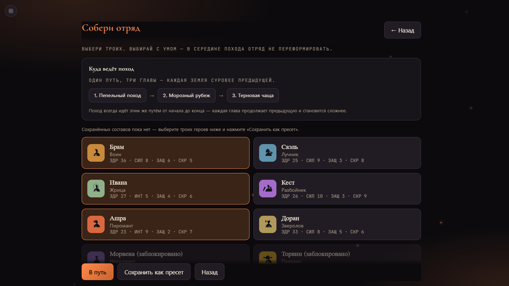
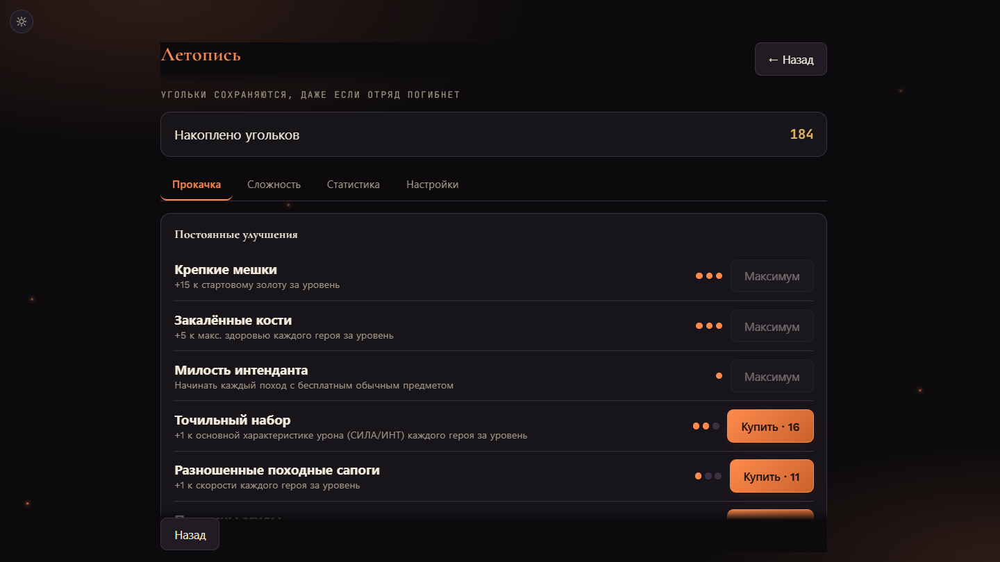
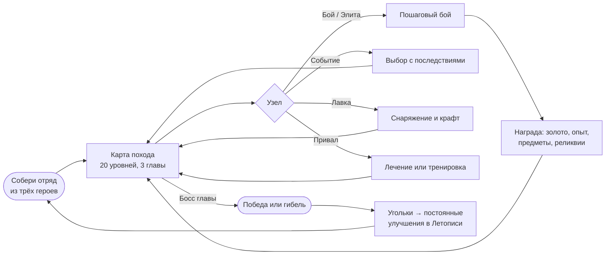
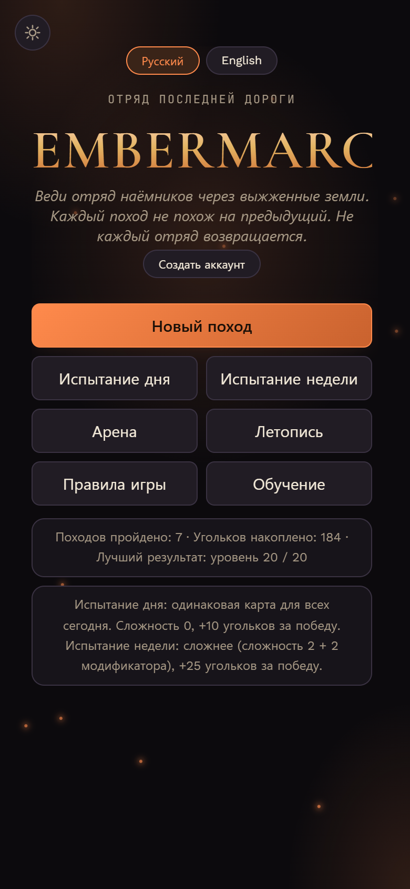
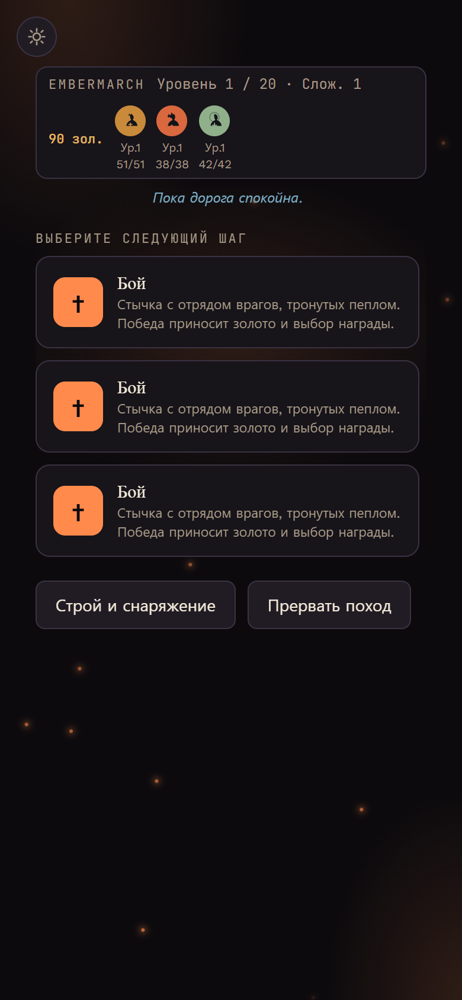
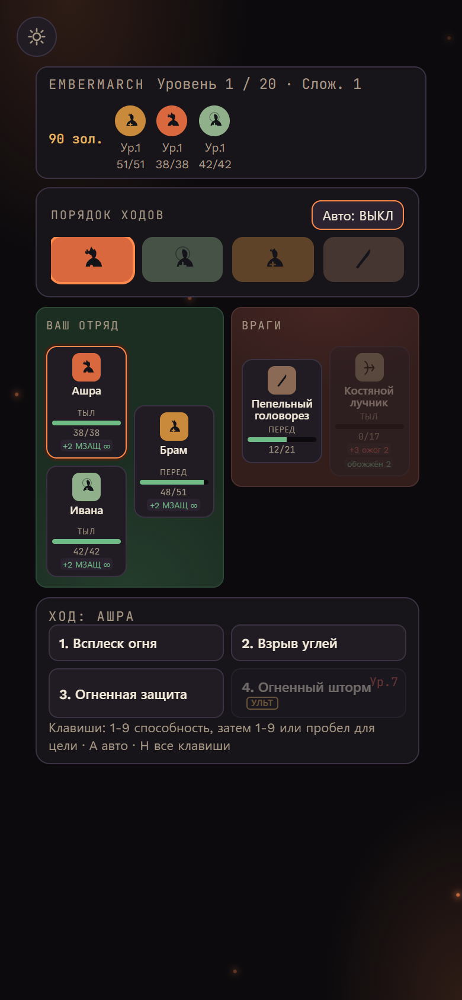
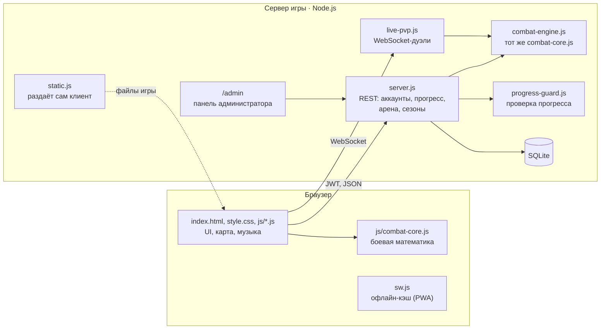

<div align="center">


# Embermarch

**Отряд последней дороги** · браузерная roguelite-RPG с пошаговыми боями

*Веди отряд наёмников через выжженные земли. Каждый поход не похож на предыдущий. Не каждый отряд возвращается.*


[](../../releases/latest)
[](../../releases)
[](LICENSE)

**[⬇ Скачать APK](../../releases/latest/download/Embermarch.apk)** &nbsp;·&nbsp; [Как установить](#на-телефоне) &nbsp;·&nbsp; [Все версии](../../releases)

</div>

<p align="center">
  
  
</p>
<p align="center">
  
  
</p>
<p align="center">
  
</p>

## Содержание

- [Как играть](#как-играть)
- [Возможности](#возможности)
- [На телефоне](#на-телефоне)
- [Архитектура](#архитектура)
- [Структура проекта](#структура-проекта)
- [Локальный запуск](#локальный-запуск)
- [Инструменты разработчика](#инструменты-разработчика)
- [История разработки](#история-разработки)
- [Лицензия](#лицензия)

## Как играть



Поход проходит через три главы: **Пепельный поход**, **Морозный рубеж** и **Терновую чащу**. Каждая глава сложнее предыдущей и заканчивается боссом. За любой исход отряд получает угольки. На них в Летописи покупаются постоянные улучшения, и следующий поход начинается сильнее.

## Возможности

<table>
<tr>
<td width="50%" valign="top">

### ⚔️ Бой
- Пошаговая тактика: передний и задний ряд, порядок ходов по скорости
- Статусы: горение, оглушение, метки, усиления и ослабления; комбо между героями
- Синергии состава отряда
- Ульты с 7-го уровня, автобой, горячие клавиши
- Процедурная музыка для каждого биома и босса

</td>
<td width="50%" valign="top">

### 🛡️ Герои и прогрессия
- 8 героев: воин, лучник, жрица, разбойник, пиромант, зверолов, некромант, паладин
- Свой герой: очки характеристик, пассивка, цвет и иконка
- Уровни и перки внутри похода
- 19 постоянных улучшений с ветками и вершинами
- Новых героев открывают достижения

</td>
</tr>
<tr>
<td valign="top">

### 🗺️ Реиграбельность
- Процедурная карта с ветвящимися путями
- Событийные цепочки, привязанные к биомам
- Снаряжение, реликвии, крафт, рюкзак
- Сложность 0–5, режим истории для новичков, модификаторы
- **Испытание дня** и **испытание недели**: одна карта для всех
- Бесконечный поход после финального босса
- Бестиарий, 19 достижений, подробная статистика

</td>
<td valign="top">

### 🏟️ Арена (PvP)
- Асинхронные бои против чемпионов других игроков
- Живые дуэли через WebSocket: очередь или приглашение по коду
- **Результат считает сервер**: чемпионы собираются из серверных таблиц, клиенту не доверяем
- Сезоны по 28 дней, рейтинг, награды за место
- Повторы боёв

</td>
</tr>
<tr>
<td valign="top">

### 💾 Аккаунты
- Прогресс хранится на сервере, можно играть с любого устройства
- Гостевой режим без регистрации, его прогресс переносится в новый аккаунт
- Сервер проверяет, правдоподобен ли прогресс (угольки не растут быстрее игры)
- Код сохранения для резервной копии

</td>
<td valign="top">

### ✨ Интерфейс
- Каждый экран помещается в окно, страница не прокручивается
- PWA: устанавливается на телефон и рабочий стол
- Тёмная и светлая темы, режим для дальтоников
- Масштаб текста, отключение анимаций
- Обучение для новых игроков, правила игры
- Русский и английский

</td>
</tr>
</table>

## На телефоне

У мобильной версии своя раскладка: крупный список доступных узлов вместо широкой карты и компактное поле боя.

<p align="center">
  
  &nbsp;
  
  &nbsp;
  
</p>

### Приложение для Android

1. Скачайте **[Embermarch.apk](../../releases/latest/download/Embermarch.apk)** на телефон (Android 7.0+).
2. Откройте файл и разрешите установку из этого источника. Если Google Play Защита предупредит о незнакомом приложении: «Подробнее» → «Всё равно установить».

Игра целиком лежит в APK: гостевой режим работает без сети, аккаунт, синхронизация и арена подключаются к серверу игры. Сборка: [android/](android/) (`./gradlew assembleRelease`, адрес сервера - в `android/game.properties` по образцу `game.properties.example`).

## Архитектура



| Часть | Стек |
|---|---|
| Игра | vanilla JS без сборки и зависимостей: `index.html`, `style.css`, `js/*.js` |
| Звук | Web Audio API: процедурная музыка + короткие эффекты (`audio/`) |
| Backend | Node.js, Express, `ws` |
| База данных | SQLite (`better-sqlite3`) |
| Безопасность | bcrypt, JWT с отзывом сессий, rate limit, CSP для админки |
| Хостинг | VPS за nginx: один Node-сервер раздаёт и игру, и API |

Боевая математика живёт в одном файле `js/combat-core.js`: его исполняют и браузер, и сервер, который сам считает исход PvP. Сборку чемпионов арены и обёртки сверяет `tools/parity-check.js`.

## Структура проекта

```
embermarch/
├── index.html              # разметка экранов и порядок скриптов
├── style.css               # стили
├── js/                     # логика игры (combat-core.js общий с сервером)
├── sw.js, manifest.webmanifest, icons/   # PWA
├── audio/                  # короткие звуковые эффекты
├── server/
│   ├── server.js           # REST API, аккаунты, прогресс, арена
│   ├── live-pvp.js         # WebSocket-дуэли
│   ├── combat-engine.js    # combat-core.js для live PvP
│   ├── static.js, client-dir.js   # раздача игры
│   ├── champion.js         # сборка чемпионов арены на сервере
│   ├── seasons.js          # сезоны и повторы
│   ├── progress-guard.js   # проверка правдоподобия прогресса
│   ├── admin.js, public/admin.html   # панель администратора (/admin)
│   ├── hero-defs.json      # таблицы, выгруженные из клиента
│   └── DEPLOY.md           # развёртывание на сервере
├── tools/                  # симулятор баланса, паритет, сборка архива деплоя
├── screenshots/            # картинки для README
├── CHANGELOG.md            # история изменений
└── ROADMAP.md              # планы
```

## Локальный запуск

Игре не нужна сборка: можно открыть `index.html` в браузере (аккаунты тогда идут на боевой сервер, гостевой режим работает офлайн).

Для аккаунтов и арены запустите backend:

```bash
cd server
cp .env.example .env    # задайте JWT_SECRET
npm install
npm start               # http://localhost:4000
```

Локальный сервер сам раздаёт игру из корня репозитория: откройте http://localhost:4000, и игра будет работать с ним. Развёртывание на сервере описано в [`server/DEPLOY.md`](server/DEPLOY.md).

## Инструменты разработчика

```bash
# бот играет целые походы на настоящем коде клиента
node tools/balance-sim.js --runs 100 --asc 0,2,4 --meta fresh,mid,max

# кривая прогрессии нового аккаунта
node tools/balance-sim.js --career 30

# клиентский и серверный движки дают одинаковый результат
node tools/parity-check.js --duels 1000 --equip

# выгрузка таблиц героев и улучшений для сервера
node tools/gen-hero-defs.js
```

## История разработки

Подробный список изменений по датам: [CHANGELOG.md](CHANGELOG.md). Планы и известные ограничения: [ROADMAP.md](ROADMAP.md).

## Лицензия

Код игры, сервера и Android-обёртки распространяется по лицензии [MIT](LICENSE).

Музыка и звуки - CC0 (общественное достояние), авторы и источники перечислены в [audio/CREDITS.md](audio/CREDITS.md). Шрифты (Marcellus, Cormorant Garamond, Work Sans, JetBrains Mono) подключаются с Google Fonts и распространяются по SIL Open Font License; в репозитории их нет.
