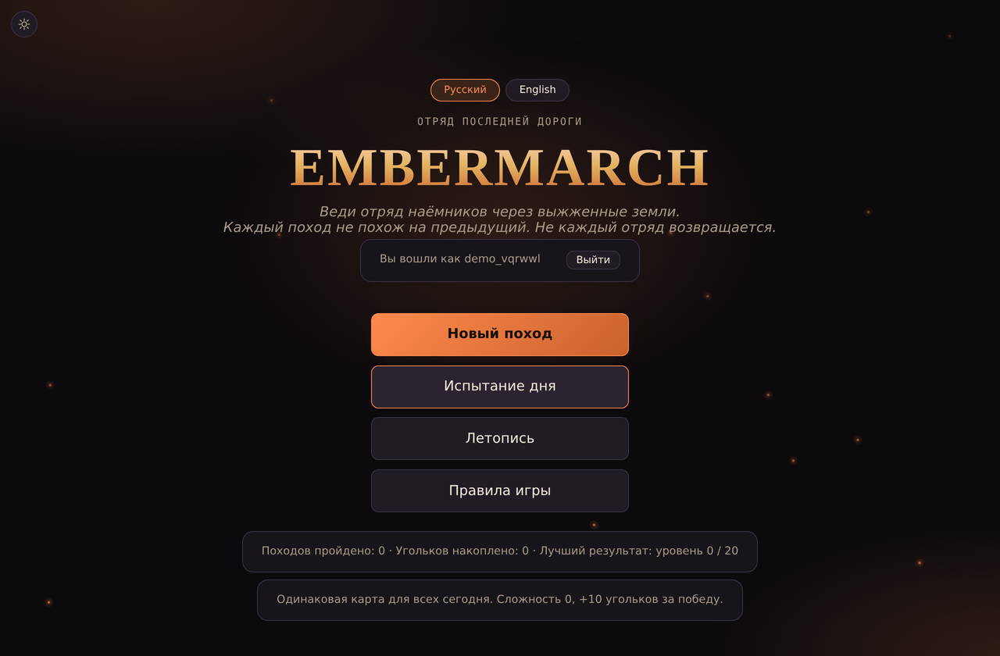
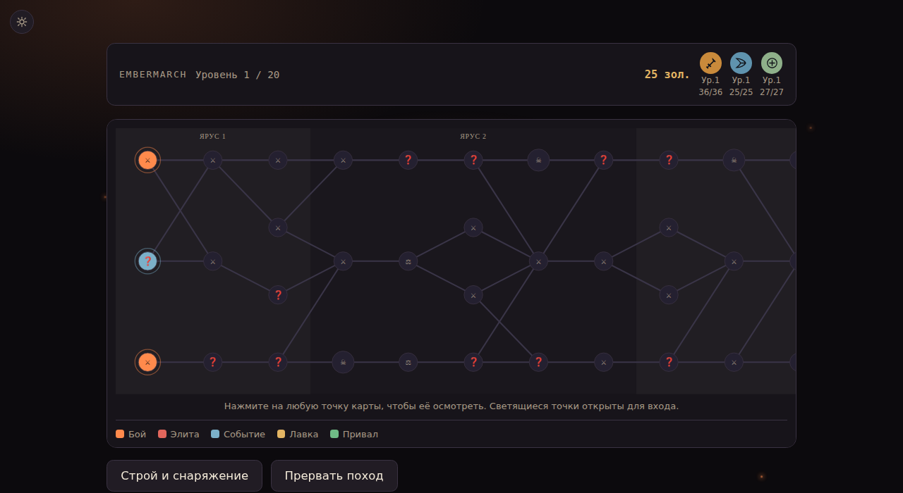
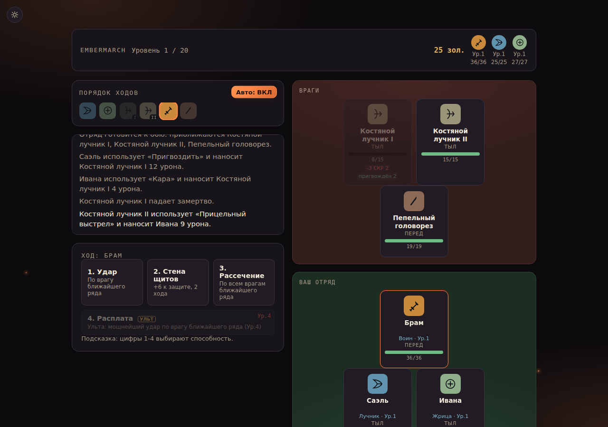

# Embermarch

**Отряд последней дороги** — браузерная roguelite-тактическая RPG с русской и английской локализацией.


**[▶ Играть онлайн](https://wiverhome.github.io/embermarch/)**

<p align="center">
  
  
  
</p>

Веди отряд наёмников через выжженные земли. Каждый поход — новая карта,
новый отряд, новые решения. Не каждый отряд возвращается.

## Содержание

- [Возможности](#возможности)
- [Аккаунты и сохранение прогресса](#аккаунты-и-сохранение-прогресса)
- [Технологии](#технологии)
- [Структура проекта](#структура-проекта)
- [Локальный запуск](#локальный-запуск)
- [История разработки](#история-разработки)

## Возможности

**Бой**
- Пошаговая тактическая боевая система: передний и задний ряд, цели, статусные эффекты, комбо между героями
- Процедурные звуковые эффекты боя (Web Audio API, без аудиофайлов)

**Герои и прогрессия**
- 8 героев с уникальными классами и способностями
- Создание собственных героев — распределение очков характеристик и выбор пассивного навыка
- Прокачка героев внутри похода: опыт, уровни, выбор перков
- Дерево постоянных улучшений между походами с ветками и капстоун-узлом
- Найм дополнительных наёмников, открываемых через достижения

**Контент и реиграбельность**
- Система реликвий и снаряжения — рюкзак, снятые вещи не теряются
- Ветвящиеся цепочки событий на карте похода
- Несколько биомов и модификаторов сложности
- «Испытание дня» — одинаковая для всех карта с полностью детерминированным сидом
- Достижения и журнал прошлых походов

**Интерфейс**
- Русская и английская локализация
- Тёмная и светлая темы
- Адаптивная вёрстка под мобильные экраны

## Аккаунты и сохранение прогресса

Прогресс (герои, улучшения, угольки, достижения и т. д.) хранится **на
сервере**, привязан к аккаунту (логин + пароль) и не зависит от
`localStorage` браузера — можно продолжить поход с любого устройства.
При первом запуске игра показывает экран входа/регистрации.

Чтобы аккаунты заработали на живом сайте (GitHub Pages), нужно развернуть
небольшой backend-сервис из папки [`server/`](server/) на своём сервере.
Пошаговая инструкция — в [`server/DEPLOY.md`](server/DEPLOY.md). Пока backend
не развёрнут, экран входа будет показывать ошибку сети.

## Технологии

| Часть | Стек |
|---|---|
| Игра | Один самодостаточный HTML-файл: vanilla JS, без сборки и зависимостей |
| Звук | Web Audio API (процедурная генерация, без сэмплов) |
| Backend | Node.js, Express |
| База данных | SQLite (`better-sqlite3`) |
| Аутентификация | bcrypt + JWT-сессии |

## Структура проекта

```
embermarch/
├── index.html          # вся игра — разметка, стили и логика в одном файле
├── server/              # backend для аккаунтов и серверного сохранения
│   ├── server.js
│   ├── package.json
│   ├── .env.example
│   └── DEPLOY.md        # пошаговая инструкция по развёртыванию
├── screenshots/          # изображения для этого README
├── CHANGELOG.md          # список изменений по датам
└── ROADMAP.md            # планы и известные ограничения
```

## Локальный запуск

Сама игра не требует сборки — достаточно открыть `index.html` в браузере.
Для входа в аккаунт нужен запущенный backend (см.
[`server/DEPLOY.md`](server/DEPLOY.md) для продакшена) либо локальный
инстанс для разработки:

```bash
cd server
cp .env.example .env
npm install
npm start
```

По умолчанию backend слушает `http://localhost:4000`. Чтобы игра стучалась
в локальный сервер, замените значение `API_BASE` в начале `<script>` в
`index.html` на `http://localhost:4000/api`.

## История разработки

Подробный список изменений по датам — в [CHANGELOG.md](CHANGELOG.md).
Планы и известные ограничения — в [ROADMAP.md](ROADMAP.md).
